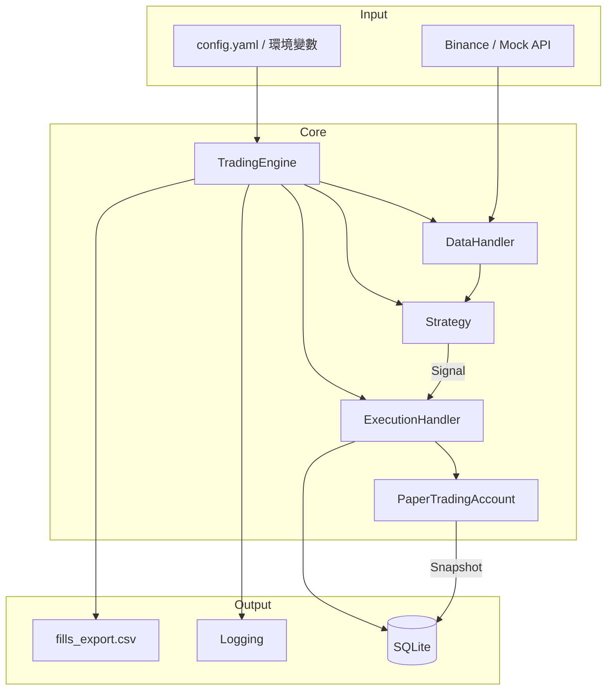
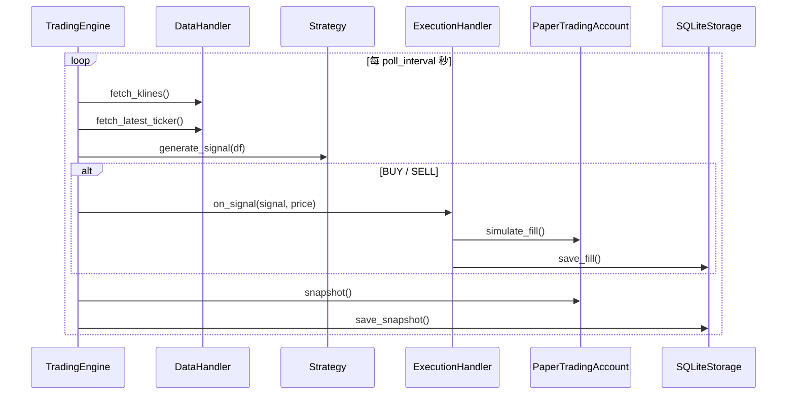

# 模擬程式交易系統 (Paper Trading)

基於 OOP 的模組化模擬交易框架，串接真實報價 API，在本地模擬帳戶中執行策略並記錄績效。

## 系統架構



## 運行流程



## 模組說明

| 模組 | 檔案 | 職責 |
|------|------|------|
| DataHandler | `paper_trading/data/handler.py` | Binance / Mock K 線與 Ticker |
| Strategy | `paper_trading/strategy/base.py` | 均線交叉 + 可擴充介面 |
| Portfolio | `paper_trading/portfolio/paper.py` | 虛擬資金、持倉、手續費、滑點、PnL |
| ExecutionHandler | `paper_trading/execution/handler.py` | 模擬下單與交易日誌 |
| Storage | `paper_trading/storage.py` | SQLite + CSV 匯出 |
| Engine | `paper_trading/engine.py` | 主迴圈協調 |

## 快速開始

```bash
cd ~/Projects/futu-trading-platform
source .venv/bin/activate
pip install pyyaml httpx pandas

# 演示（Mock 數據，約 2 分鐘）
PAPER_DEMO=1 PAPER_DATA_PROVIDER=mock python main.py

# 24 小時 Binance 真實報價模擬
PAPER_DATA_PROVIDER=binance python main.py
```

## 環境變數

| 變數 | 說明 |
|------|------|
| `PAPER_DEMO` | `1` 時使用演示時長 |
| `PAPER_DATA_PROVIDER` | `binance` / `mock` |
| `PAPER_SYMBOL` | 交易對，如 `BTCUSDT` |
| `PAPER_RUN_HOURS` | 運行時長（小時） |
| `PAPER_CONFIG` | 配置檔路徑 |

## 自訂策略

繼承 `Strategy` 並實作 `generate_signal()`，在 `create_strategy()` 註冊即可。
